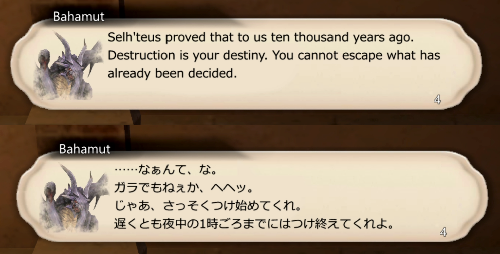

# Balloon

Balloon displays NPC dialogue in a customizable speech balloon.

## Default theme in FFXI

The default theme displays NPC dialogue with the speaker's name, optional
portrait, wrapped dialogue text, and the prompt countdown:



## Installation

1. Download or clone this repository.
2. Copy the entire `Balloon` folder into your Windower 4 `addons` folder. The
   result should look like this:

   ```text
   Windower4/addons/Balloon/Balloon.lua
   Windower4/addons/Balloon/ui.lua
   Windower4/addons/Balloon/theme.lua
   Windower4/addons/Balloon/themes/
   Windower4/addons/Balloon/portraits/
   ```

   Do not copy only `Balloon.lua`; the themes, portraits, and Lua modules are
   part of the addon.
3. Open the file `Windower4/scripts/init.txt` in a text editor and add this
   exact line:

   ```text
   lua l balloon
   ```

   This makes Windower load Balloon automatically for every character and
   session. You do not need to run a load command manually each time.

For a one-time manual test, start Windower 4, log into a character, and run
the following command instead:

```text
//lua load balloon
```

If it does not load, confirm that the folder is exactly named `Balloon` and
that `Balloon.lua` is directly inside it. The addon uses Windower's built-in
Lua libraries and does not require a separate dependency installation. After
loading it, try `//bl help` for the available commands. Use `//bl 2` to show
both the normal log and the balloon, which is the safest mode for first-time
setup.

## Commands

Use `//balloon` or `//bl`.

```text
//bl 0                 Disable future balloons and show the log.
//bl 1                 Show balloons and hide the log.
//bl 2                 Show balloons and show the log.
//bl reset             Reset the balloon position.
//bl theme <name>      Load a theme from themes/<name>/.
//bl theme list        List the bundled themes and current theme.
//bl scale <number>    Scale the balloon, for example 1.5.
//bl delay <seconds>   Set the promptless close delay; decimals are allowed.
//bl text_speed <n>    Set animated text speed in whole characters per frame.
//bl animate           Toggle the animated advancement prompt.
//bl portrait          Toggle character portraits.
//bl system            Toggle system-message balloons.
//bl move_closes       Toggle closing balloons when the player moves.
//bl debug <mode>      Enable debug output (off, all, mode, codes, chunk,
                      process, chars, or input).
//bl test <name> : <message>
                      Display a test balloon.
//bl help              Show help.
```

To enable additional message modes, edit the generated `settings.xml` and add
mode numbers to `AdditionalChatModes`. Mode 142 is excluded by default because
it commonly contains fishing and item-acquisition messages.

## Usage notes

The balloon can be repositioned with the mouse while it is visible. Mode 0
only disables future balloons; it does not close one already on screen. Themes
select the appropriate English or Japanese font.

In mode 1, Grounds Tome and Field Manual page details appear together in the
balloon. Balloon advances the intermediate lines automatically and waits for
Enter at the final "Training area" line so you can read the complete page. The
normal FFXI log stays hidden. Field Manual text after the page is shown
separately.

For dialog troubleshooting, `//bl debug input` writes incoming text returns and
Enter events to `Balloon/debug-input.log`. Run `//bl debug off` when finished.

Themes are stored under themes/. Portraits are stored under portraits/.
Character-specific balloon backgrounds go under themes/<name>/characters/.
The bundled `dark-fade` theme uses a near-black panel with softly faded edges;
load it with `//bl theme dark-fade`.
The bundled `ffxi-window5` and `ffxi-window5-solid` themes reproduce the newer
FFXI Window 5 dialogue styles. The `-solid` variant uses an opaque background.

## More information

See [docs/Portrait-Creation.md](docs/Portrait-Creation.md) for portrait guidance.
Feedback is welcome via
the GitHub issue tracker:
https://github.com/aldenpark/Balloon
